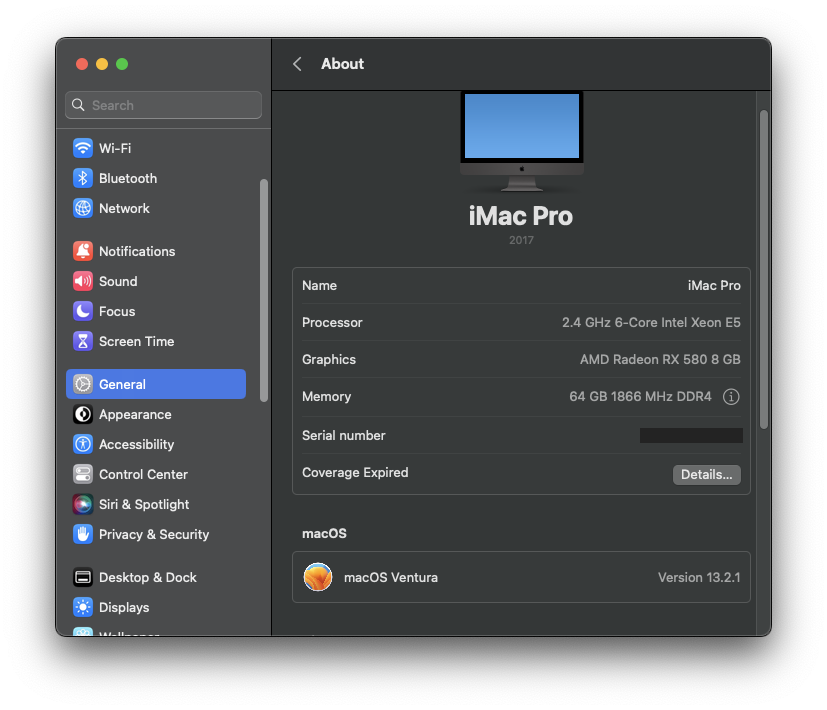

#  HUANANZHI X99-8M-F Hackintosh

    

This repository contains my EFI configuration for my custom build.

This is a multiboot system, with each OS (`Mac OS Ventura 13.2.1`, `Windows 11`, `Ubuntu 22 LTS`) running fron its own storage device. 

[Opencore 0.9.0](https://github.com/acidanthera/OpenCorePkg) is the most recent version deployed. Although it could easily all the OSes, I tend to only boot MAC OS from it to avoid any drop in performances. 

The guide is based on [Dortania's OpenCore Install Guide](https://dortania.github.io/OpenCore-Install-Guide/) and my personal experience.

I would recommend upgrading the BIOS if it is not on the more recent version [FROM THE OFFICIAL SUPPORT PAGE](http://www.huananzhi.com/html/1/184/185/551.html)

Some informations (Serial Number, MLB, ROM...) have been obfuscated. Update your `Config.plist` accordingly.

  

  

## Table of Contents
<!-- AUTO-GENERATED-CONTENT:START (TOC:collapse=true&collapseText="Click to expand") -->

CLICK TO EXPAND

  
* [THE BUILD](#the-build)
* [BIOS SETTING](#bios-setting)
* [TOOLS USED](#tools-used)
* [MISCELLANEOUS](#miscellaneous)
* [POST INSTALL VOLUME PATCH](#post-install-volume-patch)
* [SETTING UP OPENCORE GUI](#setting-up-opencore-gui)
* [CREDITS](#credits)

<!-- AUTO-GENERATED-CONTENT:END -->

## THE BUILD

* **CPU:** Intel(R) Xeon(R) CPU E5-2620 v3 @ 2.40GHz
* **Motherboard:** [HUANANZHI X99 8M F](http://www.huananzhi.com/html/1/184/185/551.html) (I got it cheap from China and it supports ECC/REG RAM!!)
* **Memory:** Samsung LRDIMM 2x 32GB DDR4 ECC 1866MHZ
* **Storage (macOS):** x1 Micron 1100 1TB 2.5" Sata SSD (Shoutout to [/r/hardwareswap](https://www.reddit.com/r/hardwareswap/) )
* **Storage (Windows):** Inland Professional SATA 240GB SSD (Free at Microcenter)
* **Storage (Ubuntu):** Inland Professional SATA 240GB SSD
* **GPU:** *Upgraded to an RX 580* --- NVIDIA GeForce GT 710 2GB ( Not for anything Graphic intensive. I only got it for my project, nice for Graphic Acceleration )
* **Power Supply:** [EVGA SuperNOVA 650 Ga 650W](https://www.amazon.com/EVGA-Supernova-Modular-Warranty-220-GA-0650-X1/dp/B07WW1XK45)
* **Case:** [Montech Flyer Micro ATX](https://www.newegg.com/black-montech-flyer-atx-mid-tower/p/2AM-00CN-00001)
* **Audio:** Realtek ALC662

## BIOS SETTING

* Serial Port : `Disabled`
* CSM Support: `Enabled`
* BootOption: `UEFI and Legacy`
* XHCI/EHCI Hand-off: `Enabled`
* VTD: `Disabled`
* Intel VT: `Enabled`
* Secure boot: `Disabled`
* Fast boot: `Disabled`

## TOOLS USED

> ### [GenSMBIOS](https://github.com/corpnewt/GenSMBIOS) to generate System Serial Number and System UUID etc.

> ### [MountEFI](https://github.com/corpnewt/MountEFI) to mount the EFI partition

> ### [SSDTTime](https://github.com/corpnewt/SSDTTime) to dump DSDTs and create SSDTs

> ### [ProperTree](https://github.com/corpnewt/ProperTree) a very nice GUI plist editor

## MISCELLANEOUS

As I mentioned earlier, I followed [Dortania's OpenCore Install Guide](https://dortania.github.io/OpenCore-Install-Guide/) as my main reference. 

Keep in mind that your build might be different from mine because of all different components. Follow the guide accordingly. 

My CPU is `Haswell E` so I followed [this PART of the guide](https://dortania.github.io/Getting-Started-With-ACPI/ssdt-methods/ssdt-prebuilt.html#haswell-and-broadwell-e) . You could use Prebuilt SSDTs, it will work but will also make your system boot slowly because of way too many bloats. I would recommend doing it manually (compiling and decompoling) or using an automated tool such as SSDTTime.

Always do a `Clean Snapshot` (Cmd+Shift+R) with Propertree after making any change in the EFI folder.

## POST INSTALL VOLUME PATCH

**Update**

/// I recently upgraded my GPU to an RX 580. So this step is not anymore applicable in my case. However, I will still let it be. It might come handy for someone else. ///

`ONLY APPLY THIS PATCH IF YOU ARE RUNNING ON MAC OS 12 MONTEREY!!`

Unfortunalely, starting on Mac OS Monterey, Apple has dropped native support for `Kepler dGPUs (600 - 800 series)`. My GT 710 being one of them, I'm required to patch the OS to have graphic acceleration. Remember that this only necessarily if your OS is `Monterey`. It is natively supported by any OS below Monterey.

I used [OpenCore Legacy Patcher (OCLP)](https://github.com/dortania/OpenCore-Legacy-Patcher/releases) , but [Geforce Kepler patcher](https://github.com/chris1111/Geforce-Kepler-patcher) from `Christ1111` could as well being used as they both Install Nvidia binaries files for macOS Monterey. The chcoice is yours.
> - Dowload [OpenCore Legacy Patcher (OCLP)](https://github.com/dortania/OpenCore-Legacy-Patcher/releases)
> - Disable SIP with this value `EF0F0000` in `csr-active-config`
> - Open the app
> - Hit on `Post Install Root Patcher`
> - It should automatically detects which patch is available for the system, in my case, `Nvidia Kepler`.
> - Hit on `Start Root Patching` and reboot the system.

 

## SETTING UP OPENCORE GUI

You could get Opencore to look nicer as [THEME IS FULLY SUPPORTED.](https://dortania.github.io/OpenCore-Post-Install/cosmetic/gui.html#setting-up-opencore-s-gui) 

The theme I use is called `Antebellum`, and can be grabbed from here https://github.com/canemdormienti/Opencore-Opencanopy-Themes/tree/main/Antebellum

A few things to change to get everythings working smoothly:

> - Add `OpenCanopy.efi` to `EFI/OC/Drivers`
> - In `Misc`, change -> Boot -> PickerMode: `External` 
> - In `Misc`, change -> Boot -> PickerAttributes: `144`
> - In `Misc`, change -> Boot -> Pickervariant: `canemdormienti\Antebellum`

I have it included in my EFI folder if you decide to use it.

## CREDITS

- All thanks to the [Dortania Team](https://dortania.github.io/OpenCore-Install-Guide/misc/credit.html) for their massive and incredible work.

- Thanks to the incredible community of [/r/hackintosh/](https://www.reddit.com/r/hackintosh/)

## Star History

